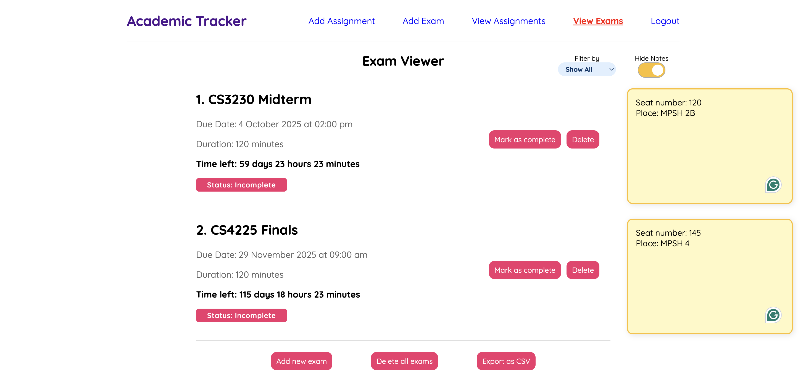

# Academic Tracker

## Overview

Academic Tracker is a MERN stack (MongoDB, Express, React, Node.js) web application designed to help students stay on top of their academic deadlines. It allows users to add assignments and exams, each with key details, and view upcoming tasks in a structured interface with real-time countdowns.

## Features

- Add assignments with description and due date  
- Add exams with description, date, and duration  
- View all upcoming assignments and exams in a timeline format  
- Real-time countdown timers for better time awareness  
- Secure authentication using JWT and password hashing  

## Live Demo

Check out the live app here [here](https://academictracker-whloh.netlify.app/)
